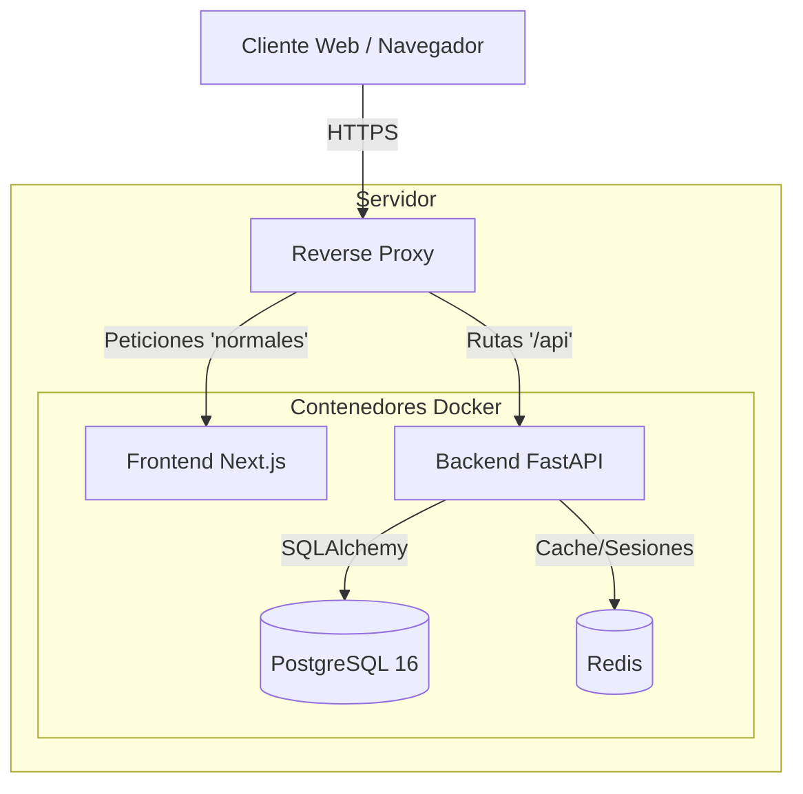
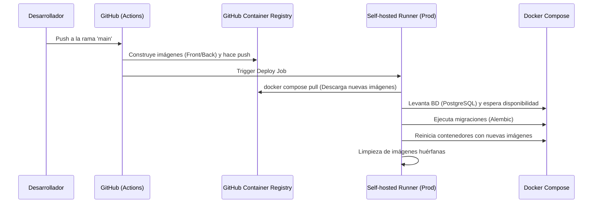
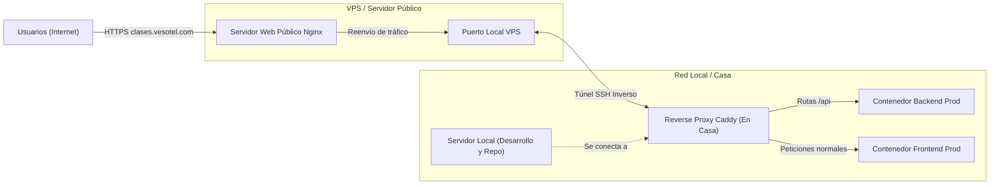

# Vesotel Gestor Jornada

Sistema SaaS para la gestión de jornadas laborales y registros de trabajo (Work Logs), diseñado para entornos multi-empresa. Utiliza una arquitectura moderna basada en microservicios contenerizados, con un backend robusto en Python (FastAPI) y un frontend reactivo en Next.js.

---

## 🏛️ Arquitectura del Sistema

El sistema sigue una arquitectura de microservicios contenerizados, separando claramente las responsabilidades.



### Componentes Principales

| Componente | Tecnología | Responsabilidad |
| :--- | :--- | :--- |
| **Backend API** | FastAPI (Python 3.12+) | Lógica de negocio, autenticación JWT, gestión de sesiones, comunicación con base de datos. |
| **Frontend** | Next.js 14+ (App Router) | Interfaz de usuario moderna y responsiva, consumiendo el API del backend. |
| **Base de Datos** | PostgreSQL 16 | Almacenamiento persistente. Migraciones gestionadas con Alembic y SQLAlchemy. |
| **Caché** | Redis | Gestión de estados temporales y rate limiting. |

---

## 🏗️ Infraestructura y Entornos

El proyecto gestiona de forma aislada el desarrollo y la producción mediante configuraciones específicas de Docker Compose.

### 1. Servidor de Desarrollo (`docker-compose.dev.yml`)

El entorno local está diseñado para maximizar la agilidad del desarrollador mediante **Hot-Reload**.

- **Backend**: Utiliza `uvicorn` con la bandera `--reload` para reiniciar automáticamente el servidor ante cambios en el código.
- **Frontend**: Aprovecha el Fast Refresh de Next.js, reflejando instantáneamente los cambios en la UI.
- **Volúmenes**: Los directorios locales se montan directamente en los contenedores para sincronizar el código fuente.

**Cómo levantar el entorno de desarrollo:**
```bash
docker compose -f docker-compose.dev.yml up -d --build
```

### 2. Servidor de Producción (`docker-compose.prod.yml`)

El entorno de producción está optimizado para rendimiento, seguridad y estabilidad.

- **Backend**: Desplegado utilizando `gunicorn` con múltiples workers (procesos) manejando instancias de `uvicorn`.
- **Frontend**: Se sirve un build de producción optimizado (estático/server-rendered).
- **Volúmenes**: Únicamente se utilizan volúmenes para persistencia de datos (PostgreSQL, Redis), no se monta código fuente en tiempo real.

---

## 🚀 Pipeline CI/CD

El despliegue está automatizado mediante GitHub Actions y un Self-hosted Runner instalado en el servidor de producción.



**Flujo de despliegue (Despliegue Seguro GHCR):**
1. Al realizar un push o merge a la rama `main`, GitHub Actions compila las imágenes Docker del Frontend y Backend en la nube (Ubuntu).
2. Las imágenes compiladas se suben al GitHub Container Registry (GHCR).
3. Se dispara el job de despliegue en el Self-hosted Runner (Servidor de Producción).
4. El servidor descarga (`pull`) las imágenes ya compiladas desde GHCR (más rápido y seguro).
5. Levanta la base de datos y espera a que esté lista antes de ejecutar las migraciones de Alembic en un contenedor temporal.
6. Finalmente, reinicia todos los servicios con las imágenes actualizadas y realiza limpieza (`prune`).

---

## 🔐 Acceso Seguro e Infraestructura Híbrida (Túnel SSH)

El sistema utiliza una arquitectura ingeniosa para exponer la aplicación de forma segura mientras se mantienen los servidores (producción y desarrollo) en una red privada local.



**Cómo funciona el enrutamiento y acceso:**
1. **Servidor Público:** Un servidor Nginx recibe el tráfico público en `clases.vesotel.com` y gestiona los certificados Let's Encrypt. Todo el tráfico se reenvía a un puerto interno de este VPS.
2. **Túnel SSH:** Un túnel SSH conecta constantemente el servidor público (VPS) con el reverse proxy Caddy instalado en el servidor físico en casa, apuntando a ese puerto interno.
3. **Reverse Proxy (Caddy):** Al final del túnel en la red local se encuentra un reverse proxy Caddy. Caddy recibe el tráfico rebotado por el túnel y actúa como enrutador final, enviando las llamadas `/api` al contenedor de Backend y el resto del tráfico al contenedor Frontend.
4. **Desarrollo vs Producción:** Para el desarrollo de la aplicación, te conectas al servidor donde reside el repositorio y los contenedores de desarrollo, y el reverse proxy (Caddy) es capaz de redirigir o reenviar el tráfico al servidor de producción, facilitando un flujo de trabajo sin fisuras.

---

## 🛠️ Características Clave del SaaS

*   **Dynamic Scoping (Contexto Ágil)**: Permite cambiar entre diferentes empresas y roles sin cerrar sesión, validando permisos mediante el "active scope" del JWT.
*   **Impersonación de Usuarios**: Administradores pueden auditar cuentas guardando la sesión original en "backup cookies" para restaurarla sin re-autenticar.
*   **Seguridad 2FA**: Autenticación de doble factor vía TOTP. Secretos almacenados de forma cifrada (AES) en la base de datos.
*   **Database Readiness**: Sistema de reintentos inteligente en el backend para esperar la disponibilidad de la base de datos al iniciar contenedores.

---
*Vesotel - Gestión Eficiente de Entornos Multi-Empresa*
