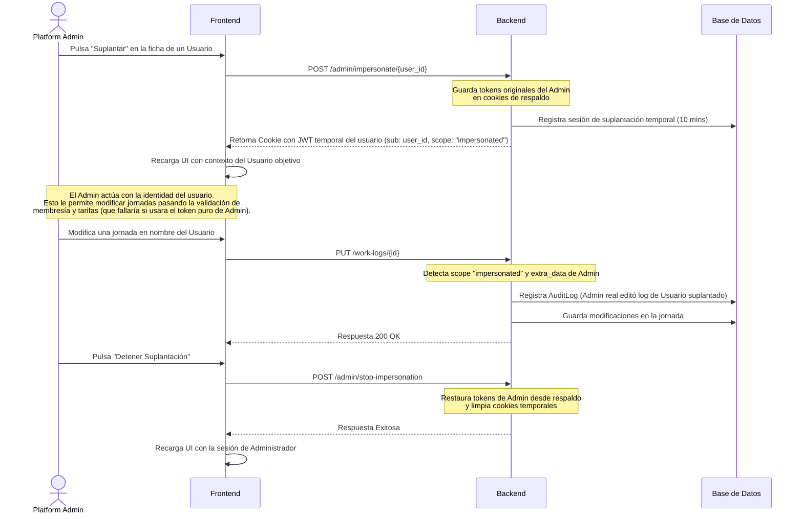

# Documento de Requisitos Funcionales (Functional Requirements Document - FRD)
## Proyecto: SaaS de Gestión de Jornadas y Turnos (SkiDev)

---

## Control de Versiones y Historial de Alineación
* **Versión:** 1.0 (Definitivo)
* **Fecha:** 13 de Julio de 2026
* **Autor:** Ingeniero de Software & Analista Funcional Senior
* **Historial de Cambios / Resoluciones:**
  * Se cataloga el módulo de estadísticas semanales de turnos (`shifts_statistics`) como una funcionalidad planificada a futuro (fase de diseño técnico).
  * Se identifica el flujo de vinculación automática a la empresa "Personal" como un comportamiento obsoleto (*deprecated*), siendo la creación de usuarios con asociación a empresa obligatoria a nivel de interfaz de usuario.
  * Se documenta la unificación funcional práctica de los roles de empresa `CompanyRole.admin` y `CompanyRole.manager`.
  * Se incorporan análisis de riesgos y planes de mejora para el control de tasas impositivas mayores al 100% y la protección de rutas del frontend.

---

## 1. Contexto y Objetivos del Sistema

### 1.1. Propósito General
La aplicación es una plataforma **SaaS (Software as a Service) multitenant** orientada a la **planificación de turnos, el control de jornadas laborales y la automatización de la facturación** en organizaciones de servicios y deportes (por ejemplo, escuelas de esquí). 

Su propósito central es proveer una interfaz dinámica para que los trabajadores reporten sus actividades diarias y mensuales, mientras que los administradores y gerentes de las empresas optimizan la supervisión operativa y analizan los costos económicos del personal. La plataforma calcula automáticamente los costos totales de la empresa (en base bruta) y los pagos líquidos de los trabajadores (en base neta) aplicando impuestos y modificadores personalizados en tiempo real.

### 1.2. Roles del Sistema y Matriz de Accesos

#### A. Roles Globales (Nivel de Plataforma)
*   **Platform Admin (Superadministrador global):** 
    *   Gestiona el catálogo general de módulos del SaaS.
    *   Crea, edita y consulta todas las empresas registradas.
    *   Asigna suscripciones de módulos activos a empresas y usuarios.
    *   Gestiona y audita las cuentas de usuarios globales de la plataforma.
    *   Posee permisos exclusivos para realizar labores de soporte e inspección técnica utilizando el mecanismo de **suplantación de identidad (Impersonation)**.

#### B. Roles Internos (Nivel de Empresa / Tenant)
*   **Company Manager (Supervisor de Empresa):**
    *   Gestiona el alta, la activación y la promoción del personal asignado a su empresa.
    *   Configura tarifas y overrides de impuestos específicos para cada empleado.
    *   Crea, actualiza y elimina jornadas y turnos de sus trabajadores individuales o mediante asignaciones en lote.
    *   Visualiza e interpreta la facturación mensual del equipo, los KPIs consolidados y exporta informes corporativos.
*   **Company Worker (Trabajador Operativo):**
    *   Registra, visualiza y gestiona de manera autónoma sus jornadas individuales.
    *   Visualiza su calendario individual de turnos.
    *   Accede a sus reportes individuales de rendimiento, horas trabajadas e importes netos percibidos.
*   **Company Admin (Administrador Técnico de Empresa - *Unificado*):**
    *   *Nota de diseño:* Aunque el modelo de datos contempla un rol `CompanyRole.admin`, actualmente carece de diferenciación operativa práctica frente al rol `CompanyRole.manager`, actuando en producción bajo las mismas vistas y políticas de permisos de supervisor.

---

## 2. Requisitos Funcionales Clave (Por Módulos)

### 2.1. Módulo de Autenticación, Seguridad y Sesiones
*   **RF-01 (Creación de Cuentas de Usuario):** El alta de usuarios se realiza a través de los administradores del sistema, quienes crean las cuentas de acceso. El backend posee un endpoint de registro público (`POST /users`), pero a nivel de interfaz de usuario (frontend) no está expuesto el auto-registro directo por razones de control operativo y seguridad, siendo obligatoria la asociación del usuario a una empresa existente por el administrador.
*   **RF-02 (Inicio de Sesión y MFA - *Limitación de Interfaz*):** Login seguro por email y contraseña. Permite habilitar, configurar y desactivar de forma voluntaria la autenticación multifactor basada en TOTP (2FA) en el backend, pero actualmente no está expuesta una interfaz de usuario final en el frontend para autogestionar el 2FA.
*   **RF-03 (Flujo 2FA Pendiente):** Si un usuario tiene 2FA activo, el login exitoso inicial emite una sesión provisional corta (`2fa_pending` - 5 minutos) redirigiendo a la pantalla de verificación del código OTP. Solo al verificar el código correcto se expiden los tokens JWT definitivos.
*   **RF-04 (Gestión de Restablecimiento y Cambio Forzado de Contraseña):** Unifica los flujos de recuperación de cuentas y de primer acceso.
    *   **Enlace de Restablecimiento:** Permite a los usuarios solicitar por correo electrónico un enlace temporal firmado (que contiene un JWT personalizado) que expira tras su primer uso.
    *   **Cambio Forzoso:** Si un administrador crea una cuenta por primera vez o restablece la contraseña del usuario, el sistema activa la bandera `must_change_password`. El frontend redirige automáticamente cualquier intento de navegación del usuario a la página `/force-change-password` hasta que complete la actualización de su contraseña. No es un comportamiento ordinario modificar esta propiedad manualmente en la base de datos.
*   **RF-05 (Gestión y Revocación de Sesiones - *Limitación de Interfaz*):** El backend posee una infraestructura completa y segura para el mapeo de sesiones activas en la base de datos (con IP y User-Agent) y la revocación remota de las mismas. Sin embargo, esta funcionalidad no está implementada en el frontend actual, por lo que estas capacidades no están disponibles para el usuario final en la interfaz y quedan marcadas como mejora futura.
*   **RF-06 (Cambio de Ámbito / Switcheo de Tenant):** Permite a los usuarios que pertenecen a múltiples organizaciones o poseen varios roles alternar su contexto de sesión activo, reexpidiendo las cookies y los claims de los tokens JWT de manera inmediata.
*   **RF-07 (Suplantación con Cookies de Respaldo):** Un Administrador de Plataforma puede iniciar sesión como cualquier usuario. El sistema hace un backup automático de la sesión del administrador en cookies secundarias (`admin_access_token` y `admin_refresh_token`). La sesión de suplantación expira obligatoriamente a los 10 minutos.

### 2.2. Módulo de Administración de Empresas y Configuración Fiscal
*   **RF-09 (Creación y Edición de Empresas):** Configuración de la Razón Social, identificador fiscal (`fiscal_id`) e impuestos por defecto de la empresa (Seguridad Social e IRPF base).
*   **RF-10 (Definición Dinámica de Tipos de Jornadas):** Configuración JSONB flexible por empresa que determina los turnos aceptados (ej. *Particular*, *Tutorial*), su unidad de medida (*hours*, *days*, *fixed*), sus campos adicionales de formulario y sus modificadores de cobro.
*   **RF-11 (Contratos y Tarifas del Empleado):** Configuración JSONB específica por trabajador que determina el valor de su tarifa base para cada tipo de jornada habilitado en la empresa, configurando de forma individualizada si la tarifa es Bruta o Neta y aplicando overrides para sus deducciones personales.
*   **RF-12 (Control de Solicitudes y Estatus):** Aprobación y de-vinculación de personal en la empresa por parte de los Managers.
*   **RF-13 (Master Config Directo):** Un Platform Admin puede modificar de forma directa las configuraciones de empresa (`settings.json`, `worklog_definitions.json`, `tax_config.json`) mediante un editor JSON interactivo en la consola de administración.

### 2.3. Módulo de Jornadas y Partes Diarios (Work Logs)
*   **RF-14 (Formulario Dinámico de Jornadas):** Adaptación en tiempo real del formulario según la unidad del turno seleccionado:
    *   Unidades de Horas: Solicita Fecha y Hora de Inicio/Fin.
    *   Unidades de Días: Solicita Rango de Fechas (Fecha Inicio y Fin).
    *   Unidades Fijas: Pide Fecha e inhabilita las horas.
    *   Habilita dinámicamente inputs adicionales y selectores tipo Switch según el tipo de turno.
*   **RF-15 (Cálculo Dinámico de Coste e Integridad):** Almacenamiento instantáneo del coste bruto, neto, duración calculada y una captura histórica completa (`calculation_snapshot`) del contexto tarifario exacto vigente en el momento de creación de la jornada.
*   **RF-16 (Asignación y Edición de Jornadas en Lote):** Permite a los Managers crear una jornada idéntica para múltiples trabajadores a la vez. El sistema les asigna un identificador de grupo (`group_id`) que permite, al editar una de las jornadas, propagar en cascada los cambios a todas las jornadas hermanas de manera opcional.
*   **RF-17 (Parte Diario en Matriz):** Pantalla interactiva que muestra una matriz diaria con horas (8:00 a 20:00) y en filas los empleados. Permite registrar jornadas pulsando sobre celdas vacías y ordenar la lista de empleados mediante controles de flecha arriba/abajo.

### 2.4. Módulo de Facturación y Costes (Billing)
*   **RF-18 (KPIS Financieros Mensuales - *Estructura Heredada*):** Panel de control de facturación mensual que despliega resúmenes del coste bruto acumulado de la empresa, coste neto total, horas y días de actividad. *Limitación de diseño:* Actualmente los KPI están estructurados de forma estática en torno a "horas particulares" y "días tutoriales" por herencia técnica, requiriéndose migrar en el futuro a una agregación dinámica adaptada a las definiciones de turnos libres que configure la empresa.
*   **RF-19 (Tabla de Liquidaciones - *Estructura Heredada*):** Desglose mensual por miembro que detalla las horas, días, nocturnidades, coordinaciones y totales neto/bruto de liquidación. Al igual que los KPIs, esta tabla consolidada depende de tipos de jornadas predefinidos históricamente (*particular*, *tutorial*) en lugar de mapear dinámicamente el catálogo de turnos de la empresa.
*   **RF-20 (Exportación Financiera):** Descarga del resumen mensual directo en formato CSV.

### 2.5. Módulo de Informes y Exportaciones (Reports)
*   **RF-21 (Generación de PDF Individual):** Crea un documento PDF detallado para un empleado y rango temporal, listando cronológicamente cada turno trabajado con sus horas, descripción, tarifas e importes.
*   **RF-22 (Generación de PDF Corporativo):** Crea un documento PDF de resumen para el Manager que agrupa a todos los empleados de la organización y muestra sus horas y costes consolidados.
*   **RF-23 (Exportación de Resumen de Texto):** Generación automática de un reporte de texto legible con el listado cronológico de turnos y un resumen final de totales de horas, días y sesiones.
*   **RF-24 (Exportación de Logs a CSV):** Descarga a formato de hoja de cálculo de todos los logs brutos consultados en el filtro de informes.

### 2.6. Módulo de Catálogo y Suscripciones SaaS
*   **RF-25 (Administración de Módulos):** Gestión del catálogo de módulos activos de la plataforma y su público objetivo (Suscripciones de Empresa, de Usuario o Ambos).
*   **RF-26 (Suscripción Inline de Tenants):** Panel que lista, añade y edita las suscripciones de los módulos en una empresa o usuario de forma inline (sin redirecciones).
*   **RF-27 (Sidebar Adaptativo):** Las opciones de navegación se renderizan de forma reactiva a partir de las suscripciones activas del tenant actual. Si un trabajador no posee una suscripción activa a un módulo específico, la pantalla correspondiente se oculta del menú del sidebar, con protección mediante validación de acceso en el backend y redirección automática en el frontend si se intenta acceder por URL.

---

## 3. Casos de Uso y Flujos de Usuario Principales

### 3.1. Caso de Uso: Registro de Turno y Cálculo de Liquidaciones

#### A. Flujo Principal
1.  Un **Company Worker** accede a su panel e interactúa con el formulario para registrar un turno. El registro ocurre obligatoriamente bajo el contexto de una empresa activa seleccionada.
2.  El frontend consulta la API y carga las definiciones JSON de la empresa (`worklogDefinitions`).
3.  El usuario selecciona un tipo de turno disponible en el formulario (de las opciones dinámicas configuradas por la empresa) y completa la información. Si el turno se mide por horas (ej. duración determinada por un rango de tiempo), indica el horario de inicio y fin: *10:00 a 14:00*.
4.  Al guardar, el backend asocia la jornada a la empresa activa, obtiene la membresía del usuario y recupera su contrato de tarifas (`rates_config`).
5.  El motor de cálculo valida la duración (4.0 horas) y la tarifa base configurada para ese tipo de turno específico (ej. 25€/hora netos).
6.  Aplica el porcentaje impositivo acumulado (Seguridad Social de la empresa: 6.48% + IRPF del usuario: 15% = 21.48%).
7.  Al ser una tarifa base neta:
    *   $Importe Neto = 4.0 \times 25 = 100.00€$
    *   $Importe Bruto = 100.00 / (1.0 - 0.2148) = 127.35€$
8.  El sistema genera y guarda la jornada y el snapshot de cálculo en la base de datos de esa empresa.

#### B. Flujo Alternativo (Jornada que cruza Medianoche)
1.  El usuario registra un turno que se mide por horas con horario: *22:00 a 02:00*.
2.  Al guardar, el backend detecta que la hora de fin (02:00) es menor a la hora de inicio (22:00).
3.  El backend reescribe la duración sumando 24 horas a la diferencia (computando 4.0 horas) y avanza en un día la fecha de finalización (`end_date = start_date + 1 día`).
4.  El cálculo de importes prosigue normalmente.

### 3.2. Caso de Uso: Soporte Técnico e Impersonación de Usuario

---

## 4. Reglas de Negocio Implícitas (Mapeadas del Código)

*   **RNE-01 (Manejo de Impuestos Inversos):** En las tarifas netas, la conversión a bruto se calcula mediante la fórmula: $Bruto = Neto / (1.0 - TasasTotal)$. Si la suma de las tasas de impuestos es $\ge 1.0$ (100%), el sistema aplica un fallback matemático igualando el bruto al neto ($Bruto = Neto$) para evitar divisiones por cero o importes infinitos.
*   **RNE-02 (Auditoría Obligatoria en Impersonación):** Cualquier acción de modificación de datos (`create`, `update`, `delete` de jornadas) realizada bajo una sesión con claim `scope: "impersonated"` debe guardar un registro estructurado en la tabla `audit_logs` que asocie al administrador real con el usuario suplantado.
*   **RNE-03 (Bloqueo Preventivo de Cuentas Huérfanas):** Si un usuario regular inicia sesión y no posee ninguna membresía de empresa activa en la base de datos, el sistema detiene la renderización de la app y muestra una pantalla de bloqueo preventiva con datos de contacto del administrador.
*   **RNE-04 (Cálculo de Modificadores Extras):** Los modificadores extras asignados a turnos que se miden por horas (o basados en tiempo) pueden calcularse de forma fija (se añade el importe una sola vez por jornada) o de forma variable (se multiplica el valor extra por la duración del turno), dependiendo del flag `per_unit: true` de la configuración de tarifas.
*   **RNE-05 (Ordenación del Grid de Parte Diario):** La matriz horaria para managers ordena al personal siguiendo el criterio estricto: *Trabajadores Activos* (arriba) $\rightarrow$ *Trabajadores Inactivos* (medio) $\rightarrow$ *Managers/Admins* (abajo). El Manager puede alterar este orden arrastrando manualmente las filas, lo cual almacena el orden en un array de cookies/sesión del cliente.

---

## 5. Requisitos No Funcionales Deducibles

*   **Rendimiento y Optimización de Lectura (Caché):**
    *   Las tarifas dinámicas consolidadas de las empresas se almacenan y consultan en una caché de **Redis** bajo la clave `company_rates:{company_id}`.
    *   Cualquier inserción, modificación de estatus de miembro o cambio en su contrato invalida la clave de Redis correspondiente para asegurar consistencia.
*   **Seguridad y Cookies Protegidas:**
    *   Los tokens de acceso y de refresco son transmitidos y guardados mediante cookies del lado del cliente con flags de seguridad activados: `HttpOnly` (previene acceso vía script/XSS), `Secure` (exige HTTPS) y `SameSite: Lax` (previene ataques CSRF).
*   **Generación PDF en Cliente (Client-Side Rendering):**
    *   La compilación de informes PDF se procesa localmente en el navegador del usuario utilizando `React-PDF`. Esto ahorra recursos computacionales y ancho de banda en el servidor al no requerir motores de renderizado headless (como Puppeteer) en el backend.
*   **Arquitectura de Datos No Estructurada (JSONB):**
    *   El uso de bases de datos relacionales combinadas con almacenamiento JSONB nativo de PostgreSQL permite cambiar las definiciones de jornadas y tarifas de los empleados sin realizar alteraciones en el esquema físico de las tablas, facilitando la escalabilidad horizontal del SaaS.

---

## 6. Problemas Identificados y Mejoras Funcionales Planificadas

### 6.1. Brecha de Validación de Impuestos en la Configuración Tarifaria (Riesgo Crítico)
*   **Problema:** Actualmente no existen validaciones en la base de datos, backend ni frontend que restrinjan la configuración de tasas impositivas acumuladas (IRPF + SS + Extras) iguales o superiores al 100%. Esto desencadena el fallback en producción donde el importe Bruto se iguala al Neto, lo cual genera inconsistencias en la facturación y los resúmenes financieros del Manager.
*   **Mejora Planificada:** Implementar una validación estricta en el validador del esquema de actualización de miembros y en el formulario de tarifas del frontend, limitando la suma total de impuestos a un rango máximo razonable (ej. menor a 80%).

### 6.2. Protección de Rutas y Guardianes de Acceso (Frontend Security)
*   **Problema:** El sistema delega la restricción de privilegios en las respuestas de la API del backend (los endpoints devuelven 403 ante llamadas desautorizadas). Sin embargo, un trabajador con rol `worker` puede ingresar de forma directa escribiendo la URL `/manager/...` en la barra del navegador, lo cual puede generar componentes vacíos, layouts erróneos o fallos visuales de carga en lugar de una redirección limpia.
*   **Mejora Planificada:** Implementar un Next.js Middleware o guardián de ruta a nivel de layout que verifique el claim `activeRole` del token de sesión, redirigiendo de manera automática a `/dashboard` si un trabajador intenta acceder a rutas de supervisión.

### 6.3. Módulo de Estadísticas Semanales de Turnos (`shifts_statistics`)
*   **Especificación Planificada:** Inserción del módulo `"shifts_statistics"` en el catálogo SaaS con ámbito `"company"`.
*   **Visualización en Menú:** Mapeo de la ruta `/manager/shifts-statistics` en el sidebar dinámico, permitiendo a managers visualizar los desgloses semanales de sus empleados (dinero neto o bruto según configuración de la empresa) agrupados por tipo de unidad (Horas, Días o Sesiones Fijas).
