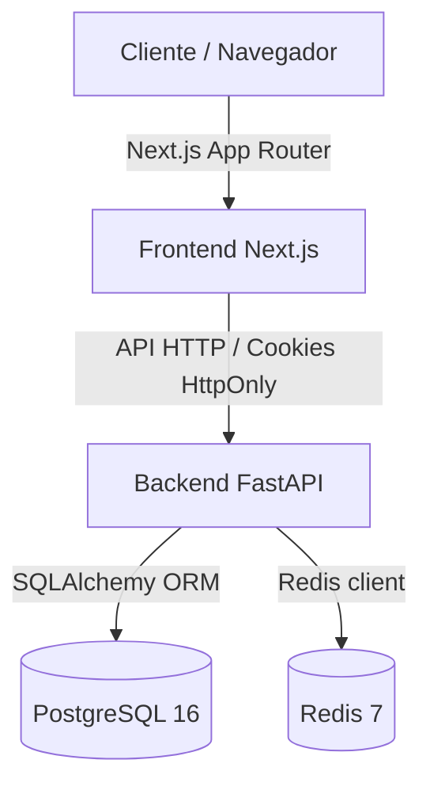
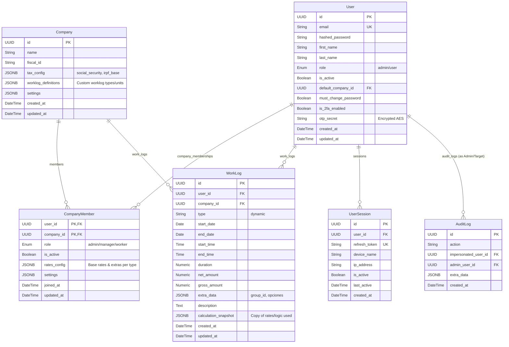
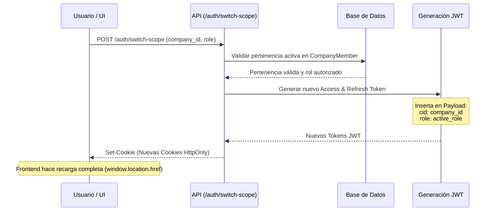

# Informe de Arquitectura - Vesotel Gestor Jornada

Este documento presenta un análisis técnico y detallado de la arquitectura de la plataforma SaaS **Vesotel Gestor Jornada**, un sistema diseñado para la gestión y registro de jornadas laborales (Work Logs) y la configuración de tarifas/impuestos adaptado a un entorno multi-empresa (multi-tenant).

---

## 1. Arquitectura de Alto Nivel y Stack Tecnológico

El sistema sigue una arquitectura desacoplada estructurada en un monorrepositorio con dos componentes principales (Frontend y Backend) intercomunicados a través de una API RESTful y soportados por servicios de persistencia y caché.



### Stack Tecnológico Principal
*   **Backend**: 
    *   **FastAPI** (Python 3.11/3.12+): Framework web asíncrono para el desarrollo del API, validación rápida y generación automática de documentación.
    *   **SQLAlchemy 2.0+**: ORM para interactuar con la base de datos PostgreSQL utilizando una sintaxis declarativa y moderna.
    *   **Alembic**: Sistema de control de versiones y migraciones de la base de datos.
    *   **Redis**: Sistema de caché en memoria para limitar peticiones (rate limiting) y gestionar listas negras de tokens y caché de tarifas.
*   **Frontend**:
    *   **Next.js 14+ (App Router)**: Framework de React con soporte de renderizado en servidor (SSR), generación estática (SSG) y optimizaciones avanzadas de rutas.
    *   **TypeScript**: Lenguaje tipado para asegurar consistencia del modelo de datos de API en el cliente.
    *   **Tailwind CSS**: Framework CSS de diseño responsivo.
    *   **React Query (TanStack)**: Gestión del estado asíncrono, caché del cliente y sincronización con la base de datos.
*   **Infraestructura**:
    *   **Docker y Docker Compose**: Contenerización modular (servicios independientes para base de datos, backend, caché, pgAdmin y frontend).

---

## 2. Modelado de Datos y Base de Datos (PostgreSQL)

La persistencia de datos está modelada en PostgreSQL con un enfoque altamente extensible a través del uso de columnas **JSONB**, lo que permite adaptar el comportamiento de la base de datos de manera dinámica para cada empresa (inquilino) sin requerir modificaciones constantes al esquema.



### Análisis de Entidades Clave

1.  **User (Usuario)**: Representa una identidad registrada en la plataforma. Tiene una configuración global (`role` de plataforma: `admin` o `user`). También maneja campos de seguridad como el estado 2FA (`is_2fa_enabled` y el `otp_secret` cifrado con una clave Fernet AES simétrica).
2.  **Company (Empresa / Tenant)**: Representa al cliente multi-empresa. Contiene su propia configuración tributaria (`tax_config`) y definiciones de tipos de jornada y horarios (`worklog_definitions`).
3.  **CompanyMember (Miembro de Empresa)**: Tabla de asociación que representa la relación e "hilo contractual" entre un usuario y una empresa específica. Almacena:
    *   El **rol local** dentro de esa empresa (`manager`, `worker`).
    *   **`rates_config` (Tarifas)**: Un JSONB que especifica el costo base de cada tipo de jornada y los modificadores (extras como nocturnidad, kilometraje) aplicables para este usuario en particular dentro de la organización.
4.  **WorkLog (Registro de Trabajo)**: Contiene los registros individuales de jornadas trabajadas. La propiedad más destacable es **`calculation_snapshot`**: guarda una copia íntegra con la que se calculó el salario neto/bruto de ese log, garantizando la **integridad histórica**. Si la empresa o el manager modifican las tarifas del empleado en el futuro, los registros pasados mantienen su integridad financiera.
5.  **UserSession (Sesiones)**: Permite registrar las sesiones activas vinculando dispositivos e IPs. Facilita la revocación remota de dispositivos específicos al invalidar tokens.
6.  **AuditLog (Registro de Auditoría)**: Almacena las trazas de acciones administrativas sensibles, principalmente las realizadas bajo la impersonación de cuentas.

---

## 3. Mecanismos Clave del SaaS y Seguridad

### A. Dynamic Scoping (Contexto de Trabajo Ágil)
El sistema permite a un mismo usuario pertenecer a múltiples empresas con diferentes roles (por ejemplo, ser `manager` en la Empresa A y `worker` en la Empresa B) y alternar entre ellas sin necesidad de cerrar e iniciar sesión nuevamente.



1.  **Carga del Scope en el JWT**: El token de acceso JWT contiene en su payload el identificador de la empresa activa (`cid`) y el rol local activo (`role`).
2.  **Validación de Permisos**: Cada endpoint valida dinámicamente si el usuario posee los permisos adecuados consultando la información inyectada en el contexto del token (por ejemplo, a través de la función dependency `is_manager_of_company`).
3.  **Cambio Dinámico de Contexto**: El endpoint `/auth/switch-scope` valida si el usuario tiene una relación activa con la empresa solicitada y si su nivel jerárquico permite adoptar el rol pedido. Si es válido, se emiten nuevas cookies de autenticación con el scope actualizado.

### B. Motor de Cálculo Dinámico (Gross/Net Modifiers)
El motor de cálculo (`calculate_dynamic_work_log` en `crud.py`) calcula los salarios bruto y neto en tiempo real basándose en configuraciones JSONB flexibles:
*   **Unidades de Medida**: Admite horas (`hours`), días (`days`) o monto fijo (`fixed`).
*   **Impuestos**: Deducción de Seguridad Social (`ss`), retención de IRPF (`irpf`) y otras retenciones secundarias (`extra`).
*   **Conversión Gross/Net**:
    *   *Si la tarifa está configurada como Bruta (`is_gross: true`)*:
        $$\text{Neto} = \text{Bruto} \times (1 - \text{Tasa de impuestos})$$
    *   *Si la tarifa está configurada como Neta (`is_gross: false`)*: Realiza un cálculo de tasa reversa para deducir el salario bruto a partir de las tarifas netas y los complementos:
        $$\text{Bruto} = \frac{\text{Neto}}{1 - \text{Tasa de impuestos}}$$
*   **Extras y Modificadores**: Evalúa en `extra_data` las opciones complementarias configuradas por el usuario (ej. `has_night: true`) y busca el recargo correspondiente en `rates_config`, sumándolo como costo por unidad o tarifa plana antes de aplicar la retención impositiva.

### C. Impersonación de Usuarios
Esta funcionalidad de SRE (Site Reliability Engineering) y administración global permite a los superadministradores de la plataforma actuar en nombre de cualquier usuario para realizar soporte técnico o auditorías.

*   **Backup de Sesiones**: Al invocar `/admin/impersonate/{user_id}`, el backend copia el token de acceso y de refresco del administrador original y los almacena en cookies de respaldo temporal llamadas `admin_access_token` y `admin_refresh_token`.
*   **Hardening del Token**: El token emitido para simular al usuario objetivo recibe el scope `"impersonated"`, incluye la ID del administrador en `"admin_user_id"`, y expira de forma acelerada en **10 minutos**.
*   **Trazabilidad total**: Cualquier creación, edición o eliminación de logs efectuada mientras se simula la identidad del usuario invoca la función `record_impersonation_audit`, guardando un registro en la tabla `AuditLog` detallando qué administrador realizó la acción y sobre qué usuario.
*   **Restauración**: Al finalizar la impersonación mediante `/admin/stop-impersonation`, el backend restablece las cookies del administrador original desde las copias de seguridad de las cookies y destruye las temporales.

### D. Seguridad y Flujo 2FA (TOTP)
*   **Firma Asimétrica (RS256)**: Los tokens JWT son firmados con una llave privada RSA (almacenada y descifrada opcionalmente con un passphrase del sistema) y validados con una clave pública RSA.
*   **Provisional Scope**: Al iniciar sesión con credenciales válidas, si el usuario tiene el 2FA habilitado, se emite un token de vida ultra-corta (5 minutos) con el scope `"2fa_pending"`. Los endpoints normales bloquean las peticiones con este scope secundario.
*   **Validación de Código**: El cliente debe llamar al endpoint `/verify-2fa` con el código dinámico TOTP provisto por el autenticador para completar la validación y recibir las cookies con el token JWT definitivo.
*   **Cifrado de Secretos**: Los secretos TOTP se encriptan simétricamente mediante AES (Fernet) antes de ser insertados en PostgreSQL.
*   **Invalidación y Revocación de Sesiones**:
    *   Las sesiones activas (`UserSession`) se registran en base de datos. Si un usuario sospecha de accesos no autorizados, puede revocar cualquier sesión activa por su ID.
    *   Para optimizar la revocación rápida de Access Tokens sin realizar consultas continuas a la base de datos, cuando un usuario cierra sesión, el ID del token (`jti`) se ingresa a una lista negra dentro de **Redis** con un tiempo de expiración equivalente al TTL restante del token. El middleware de autorización intercepta el token y deniega el acceso si la clave `bl_{jti}` existe.

---

## 4. Implementación y Estructura del Código

### Backend (FastAPI)
El backend está estructurado de forma modular con enrutadores y controladores independientes:
*   [database.py](file:///home/usuario/13_SkiDev/backend/database.py): Configura el pool de conexiones de SQLAlchemy e implementa la función generadora `get_db()`.
*   [redis_config.py](file:///home/usuario/13_SkiDev/backend/redis_config.py): Wrapper de conexión a Redis con soporte de tolerancia a fallas (failover). Si Redis no se encuentra disponible, se registran los errores sin provocar la interrupción del servicio principal.
*   [models.py](file:///home/usuario/13_SkiDev/backend/models.py): Estructura declarativa de las entidades de la base de datos relacional.
*   [schemas.py](file:///home/usuario/13_SkiDev/backend/schemas.py): Modelos Pydantic para validar entradas y formatear las salidas con un generador automático que transforma atributos de *snake_case* a *camelCase* para una correcta integración con JavaScript/TypeScript.
*   [crud.py](file:///home/usuario/13_SkiDev/backend/crud.py): Operaciones de persistencia y lógica de negocio pura (por ejemplo, el cálculo dinámico y el control de la base de datos).
*   [auth.py](file:///home/usuario/13_SkiDev/backend/auth.py): Gestión criptográfica de contraseñas (Bcrypt), cifrado Fernet, creación y decodificación de tokens JWT, control de sesiones y TOTP.
*   **routers/**: Controladores de API segmentados por recursos:
    *   `auth.py`: Rutas de inicio de sesión, refresco de credenciales, logout, gestión de 2FA y cambio de scope.
    *   `companies.py`: CRUD de empresas, adición de miembros y edición de tarifas/configuración.
    *   `users.py`: Gestión de usuarios, perfiles, restablecimiento de credenciales de acceso e invitación por email.
    *   `work_logs.py`: Creación, actualización (individual o en bloque/bulk) y borrado de jornadas de trabajo.
*   [main.py](file:///home/usuario/13_SkiDev/backend/main.py): Instancia principal de FastAPI, configuración de CORS y eventos de ciclo de vida (`lifespan`) encargados de verificar las variables críticas, esperar que la base de datos esté lista y programar una tarea asíncrona de limpieza que elimina sesiones inactivas de más de 30 días de la base de datos una vez cada 24 horas.

### Frontend (Next.js 14 App Router)
El frontend utiliza los beneficios arquitectónicos del App Router:
*   **Rutas Agrupadas (Route Groups)**:
    *   `(auth)`: Páginas no autenticadas (como `/login`).
    *   `(app)`: Páginas protegidas que requieren un inicio de sesión válido (ej: `/dashboard`, `/profile`, `/calendar`, `/admin`, `/manager`).
*   **Contexto de Autenticación (`AuthContext.tsx`)**: Gestiona de forma centralizada el estado del usuario logueado, las llamadas de autenticación, el cierre de sesión, la impersonación y el intercambio de scopes.
*   **Interlocutor API (`src/lib/api.ts`)**: Cliente Axios configurado para adjuntar cookies de forma segura (`withCredentials: true`). Permite una proxyficación simple apuntando a `/api` en lugar de una IP externa hardcodeada.

---

## 5. Arquitectura de Despliegue e Infraestructura (Docker)

El sistema aprovecha entornos de ejecución basados en contenedores independientes para entornos de desarrollo y producción:

### Entorno de Desarrollo (`docker-compose.dev.yml`)
*   **Hot-Reload**: El código fuente local se monta en los contenedores mediante volúmenes de Docker (`./backend` y `./frontend`).
*   **Refresco del código**:
    *   El backend utiliza el flag `--reload` de Uvicorn.
    *   El frontend carga en modo desarrollo (`npm run dev`) con soporte de Fast Refresh de React.
*   **Base de datos aislada**: Expone los servicios de Redis y Postgres de manera local para facilitar la inspección.

### Entorno de Producción (`docker-compose.prod.yml`)
*   **Imágenes Preconstruidas**: En lugar de compilar en el servidor de destino, las imágenes son creadas, probadas y empaquetadas en un flujo automatizado de CI/CD de GitHub Actions y almacenadas en el registro de contenedores de GitHub (GHCR).
*   **Seguridad**:
    *   Los contenedores de base de datos (`postgres`) y caché (`redis`) no exponen puertos externamente. Únicamente son accesibles a nivel de red interna de Docker (`db`).
    *   El backend y el frontend se aíslan usando una red común (`app`).
*   **Optimización del Runner de Next.js**: Utiliza compilaciones de producción optimizadas mediante el renderizado standalone (`server.js`), copiando únicamente los recursos de compilación estáticos estrictamente requeridos para reducir el peso y uso de memoria de la imagen.
*   **Servicio pgAdmin integrado (`dashboard-db`)**: Un panel gráfico de administración de base de datos integrado para los administradores que arranca en el puerto `5050` utilizando las credenciales configuradas en las variables de entorno.

---


---

## 6. Mecanismo de Inserción y Caching de Tarifas

Para evitar constantes consultas de lecturas complejas con múltiples relaciones (`JOINs` entre `CompanyMember`, `User` y `Company`), el sistema utiliza una estrategia de almacenamiento en caché en Redis:

1.  **Lectura con Fallback**: Al solicitar las tarifas de una empresa vía `get_company_rates`, el backend consulta a Redis. Si existe, decodifica el JSON en milisegundos. Si no existe, realiza la consulta SQL mediante SQLAlchemy cargando de manera eagerly (`joinedload`) las relaciones y guarda la respuesta serializada en Redis con un TTL de 1 hora.
2.  **Invalidación Activa**: Al realizar cualquier alteración en la pertenencia, alta de miembros o cambio de tarifas (`rates_config`), se ejecuta la función `_invalidate_company_rates`, encargada de eliminar de forma inmediata la clave correspondiente de Redis. Esto garantiza la consistencia del sistema frente a modificaciones administrativas.

---

## 7. Proxy Inverso y Balanceo de Carga con Caddy

El sistema utiliza un contenedor global y externo de **Caddy** (`caddy-proxy-master`), definido en la ruta de proxy maestro `~/00_Proxy`, que unifica el acceso a múltiples entornos de desarrollo y producción bajo una misma infraestructura de red externa (`proxy_network`).

```mermaid
graph TD
    User([Usuario / UI]) -->|Puerto 4400 / clases.home.com| Caddy[Caddy Reverse Proxy / LB]
    Caddy -->|/api/* (handle_path)| Backend[ski_dev-backend-1:8000]
    Caddy -->|Resto de rutas (handle)| Frontend[ski_dev-frontend-1:3000]
    Caddy -->|Puerto 8400| BackendDocs[Documentación FastAPI /docs]
    Caddy -->|Puerto 6400| PGAdmin[pgAdmin / dashboard-db]
```

### Configuración del Servicio Proxy
El archivo [docker-compose.yml](file:///home/usuario/00_Proxy/docker-compose.yml) expone los puertos necesarios en el host (como `4400`, `8400` y `6400` para el entorno Ski Dev) y los conecta a la red puente compartida `proxy_network` para enrutar el tráfico directamente a los nombres de contenedor de cada servicio.

### Directivas de Enrutamiento en Caddyfile
El archivo [Caddyfile](file:///home/usuario/00_Proxy/Caddyfile) define las reglas específicas para resolver las peticiones del proyecto de desarrollo de la siguiente manera:

*   **Punto de entrada unificado (`172.20.10.120:4400` / `clases.home.com`)**:
    *   **`/api/*`**: Redirige al contenedor del backend en `ski_dev-backend-1:8000` mediante la directiva `handle_path`, la cual elimina automáticamente el prefijo `/api` antes de pasar la petición al servidor FastAPI.
    *   **Resto de las rutas (`/*`)**: Se procesan mediante la directiva `handle` y se dirigen al servidor de desarrollo de Next.js en `ski_dev-frontend-1:3000`.
*   **Servicio de documentación (`172.20.10.120:8400`)**: Enruta directamente al backend en el puerto `8000` redirigiendo la raíz `/` hacia `/docs`.
*   **Gestión de base de datos (`172.20.10.120:6400`)**: Expone el visor de base de datos/pgAdmin (`ski_dev-dashboard-db-1:80`).

### Ventajas de esta Arquitectura
1.  **Eliminación de CORS**: Al compartir el mismo origen externo (misma IP y mismo puerto para frontend y backend), el navegador no realiza peticiones preflight de CORS y se eliminan las configuraciones complejas de cabeceras en el código del servidor.
2.  **Seguridad y TLS Automático/Local**: Caddy gestiona automáticamente certificados autofirmados con la directiva `tls internal`, habilitando HTTPS local seguro de forma transparente.
3.  **Balanceo de Carga (Load Balancing - LB)**: Caddy puede funcionar como un balanceador de carga activo y pasivo. En entornos con múltiples réplicas del frontend o backend, se pueden definir múltiples destinos dentro de la directiva `reverse_proxy` para distribuir las peticiones:
    ```caddy
    reverse_proxy ski_dev-backend-1:8000 ski_dev-backend-2:8000 {
        lb_policy round_robin
        lb_try_duration 5s
    }
    ```

---
*Vesotel - Sistema Avanzado de Gestión de Jornadas de Trabajo Multi-Empresa*

